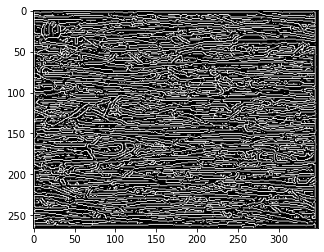
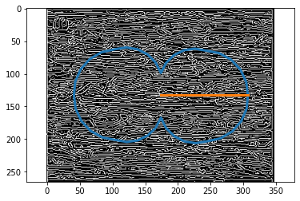

# cnt_tda
Topological data analysis of orientation alignment for SEM images of carbon nanotube fibers.

 
 

## Reference
A detailed description of this method can be found in our paper:  
**Detecting Carbon Nanotube Orientation with Topological Data Analysis of Scanning Electron Micrographs**  
by *Liyu Dong, Haibin Hang, Jin Gyu Park, Washington Mio, Richard Liang*  
https://arxiv.org/abs/2108.04375

## Dependencies
gudhi -- A package for topological data analysis ( http://gudhi.gforge.inria.fr/python/latest/installation.html )  
opencv -- A package for computer vision ( https://pypi.org/project/opencv-contrib-python/ )
